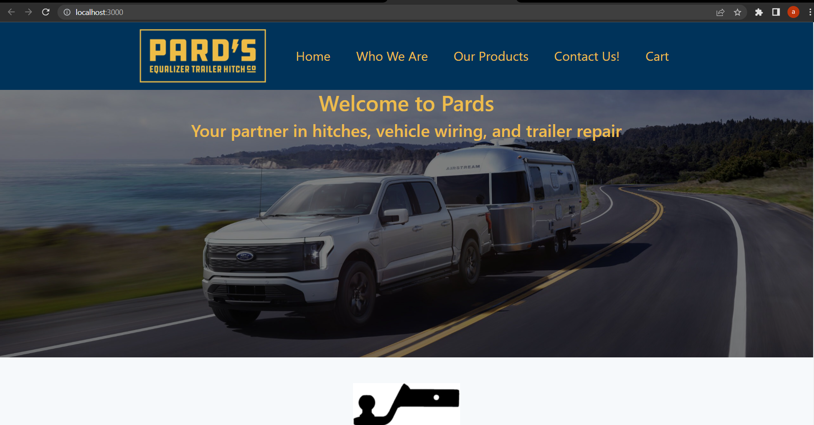
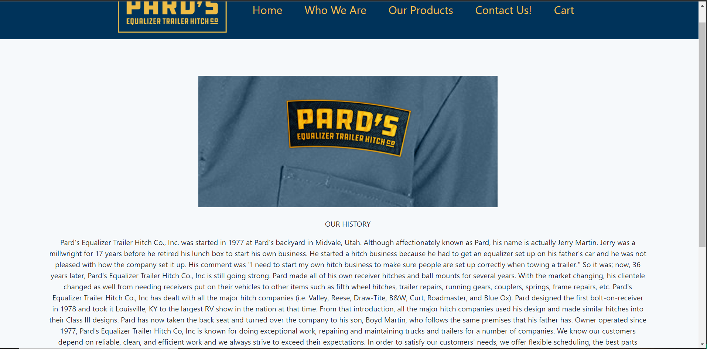
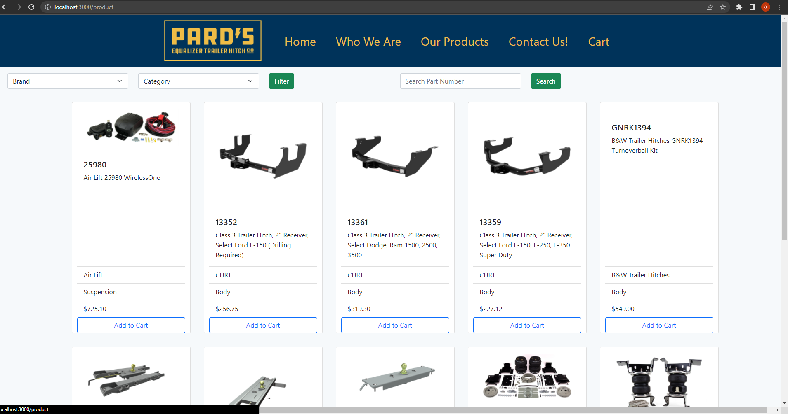
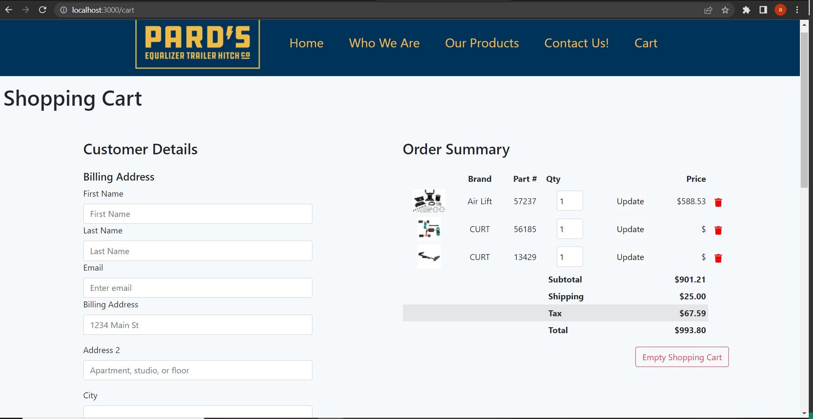
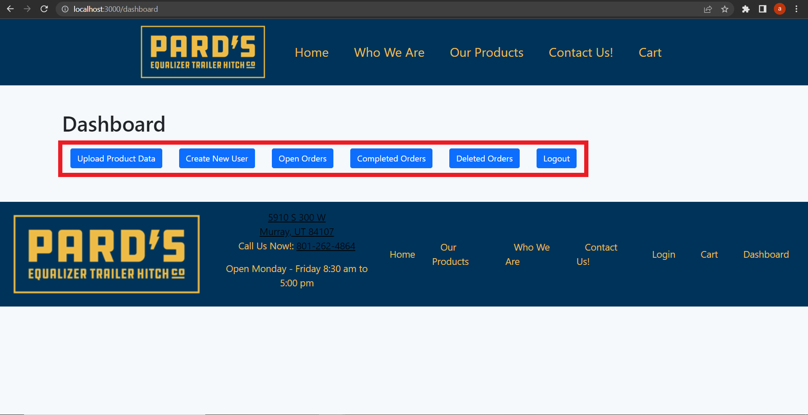

# Pard's Trailer Hitches React MERN Website

This project was bootstrapped with [Create React App](https://github.com/facebook/create-react-app).

### Description 

This was our final project for this course, it was quite hard to throw together in about 9 days. It taught me how to make decisions quickly and iterate them fast. We shot for a MVP and I feel like we got there. Not everything works on this sit yet but the majority does and works well. It was really fulfilling to get the csv file upload working. It may not be the most efficient way to fix that problem but thats whats fun about this profession is you can almost always refactor more and improve your products continually. It solved a problem that I had and made the site much more interesting. This is going to be starter point to a side gig for me in the future to create a template for an e-commerce site for resellers in the automotive business. I had many, many customers just like Pards that could really benefit from something like this and if I can have a system to easliy iterate for each business simply and cater to them individually then it could be benficial for both sides. I have lots of work to do with this system and I am excited to improve it over time. 

## Table of Contents

  * [Installation](#installation)
  * [Usage](#usage)
  * [Credits](#credits)
  * [License](#license)
  * [Screenshots](#screenshots)
  * [Questions](#questions)

### Installation

[Heroku Deployed Link](https://ancient-island-13793.herokuapp.com/)

### Credits

The module work from the entire course and help from our awesome TA's and instructer! Various code snippets from other great developers on the internet.

### Screenshots

See the following images for a preview!

### License

Permission is hereby granted, free of charge, to any person obtaining a copy of this software and associated documentation files (the "Software"), to deal in the Software without restriction, including without limitation the rights to use, copy, modify, merge, publish, distribute, sublicense, and/or sell copies of the Software, and to permit persons to whom the Software is furnished to do so, subject to the following conditions:

The above copyright notice and this permission notice shall be included in all copies or substantial portions of the Software.

THE SOFTWARE IS PROVIDED "AS IS", WITHOUT WARRANTY OF ANY KIND, EXPRESS OR IMPLIED, INCLUDING BUT NOT LIMITED TO THE WARRANTIES OF MERCHANTABILITY, FITNESS FOR A PARTICULAR PURPOSE AND NONINFRINGEMENT. IN NO EVENT SHALL THE AUTHORS OR COPYRIGHT HOLDERS BE LIABLE FOR ANY CLAIM, DAMAGES OR OTHER LIABILITY, WHETHER IN AN ACTION OF CONTRACT, TORT OR OTHERWISE, ARISING FROM, OUT OF OR IN CONNECTION WITH THE SOFTWARE OR THE USE OR OTHER DEALINGS IN THE SOFTWARE.

### Questions?

[John Davis GitHub Account](https://github.com/johndavis92790/)
[John Davis Email](mailto:jwdavis927@gmail.com)

## Built by

John Davis, Braxton Hotton, Daniel Jardine, and Aaron Humelsine
